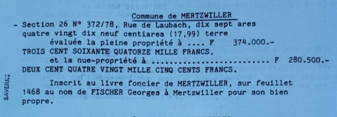
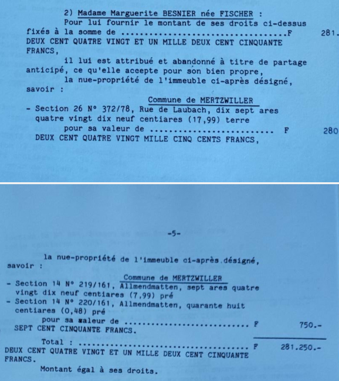

la part donnée en 1986 à Marguerite F est un **terrain nu**.

{width="600"}

> *Question: comment démontrer qu’une maison construite après la donation d’un terrain nu constitue une libéralité rapportable, même si elle est ensuite louée à bas prix à la belle‑fille de la nue‑propriétaire.*

## L'argumentation établissant la libéralité indirecte

{alt="🧭"} devant un notaire ou un juge se déroule comme suit:

1\. **Donation initiale du terrain nu** → Le donataire devient propriétaire du sol.

2\. **Construction financée par le donateur**: Preuves bancaires + factures à apporter.

3\. Application de **l’accession immobilière** → La maison construite devient la propriété du donataire par accession. Par conséquent, la valeur du terrain nu (donation initiale) augmentée de la valeur de la maison (construction financée par le donateur) constitue un enrichissement patrimonial net, lequel est rapportable. CQFD.

4\. **Absence de contrepartie** → Pas de prêt, pas de remboursement, pas de convention. Le donataire n’ayant jamais remboursé (à preuve du contraire) la jurisprudence est constante : l’absence de contrepartie suffit à caractériser l’intention libérale.

5\. **Intention libérale présumée** → Jurisprudence constante: l’absence de contrepartie suffit à caractériser l’intention libérale.

6\. **Qualification : libéralité indirecte**→ Rapport obligatoire à la succession.

7\. La location ultérieure est indifférente → Elle ne modifie pas la nature de la libéralité.

{alt="🧭"} 8. La jurisprudence française retient régulièrement que :

\- **le financement d’une construction sur un terrain appartenant au donataire constitue une libéralité indirecte,**   et que **le rapport est dû**,  

\- l’usage ultérieur du bien (occupation, location, gratuité) est indifférent.

9.  la maison a été estimée très conservativement à **une valeur de 180K €** (cf document Lotz_Technique)

## Détails de l'expert

{alt="🧭"} 1. Le principe juridique : **la construction postérieure = accession = libéralité potentielle**

En droit civil français, lorsque le donataire reçoit un terrain nu, puis qu’un tiers (souvent le donateur lui‑même) finance la construction d’une maison dessus, on applique :

→ Le mécanisme de l’accession immobilière (art. 555 et s. C. civ.)

La construction devient propriété du propriétaire du sol, c’est‑à‑dire le donataire.

Donc si le donateur finance la construction sans contrepartie, il s’agit :

→ d’un enrichissement sans cause

→ assimilé à une libéralité indirecte  

→ rapportable à la succession (art. 843 et s. C. civ.)

La location ultérieure, même à bas prix, n’efface pas la libéralité initiale.

{alt="🧭"} 2. Comment établir la libéralité : les éléments de preuve à réunir

Pour démontrer qu’il y a libéralité rapportable, il faut prouver trois choses :

{alt="🧩"} A. Le **financement effectif** de la construction par le donateur

C’est l’élément clé. Preuves possibles :

\- virements bancaires du donateur vers l’entreprise de construction  

\- factures réglées par le donateur  

\- attestations de l’architecte ou du constructeur  

\- **absence de financement par le donataire** (pas de prêt, pas d’apport personnel)  

\- comptabilité ou relevés bancaires montrant que le donataire n’a rien payé  

Si le donataire n’a rien financé, la qualification de libéralité est très difficile à contester.

{alt="🧩"} B. **L’intention libérale** (animus donandi)

Elle peut être déduite des circonstances, même sans écrit.

Indices retenus par la jurisprudence :

\- le donateur a payé intégralement la construction  

\- **le donataire n’a jamais remboursé**  

\- absence de convention de prêt ou de reconnaissance de dette  

\- le donateur n’a jamais revendiqué un droit réel (usufruit, droit d’usage, etc.)  

\- la construction augmente fortement la valeur du bien du donataire  

La jurisprudence est constante :  

{alt="👉"} **l’absence de contrepartie suffit à caractériser l’intention libérale.**

------------------------------------------------------------------------

{alt="🧩"} C. L’enrichissement du donataire

La maison construite devient sa propriété par accession.

Donc :

\- valeur du terrain nu (donation initiale)  

\- + valeur de la maison (construction financée par le donateur)  

= enrichissement patrimonial net

**Cet enrichissement est rapportable**.

------------------------------------------------------------------------

{alt="🧭"} 3. Pourquoi la location à bas prix à la belle‑fille ne change rien

C’est un point que tu soulèves, et il est important.

{alt="✔"} La location sous le prix du marché n’efface pas la libéralité initiale

La libéralité porte sur la valeur de la construction, pas sur l’usage ultérieur.

{alt="✔"} Le fait que la maison soit louée à un proche du donateur n’a aucune incidence

La jurisprudence considère que :

\- la location à bas prix peut constituer une libéralité d’usage,  

\- mais elle ne modifie pas la qualification de la construction.

{alt="✔"} Le rapport se calcule sur la valeur de la construction au jour du partage

→ pas sur les loyers  

→ pas sur l’usage  

→ pas sur l’identité du locataire

------------------------------------------------------------------------
