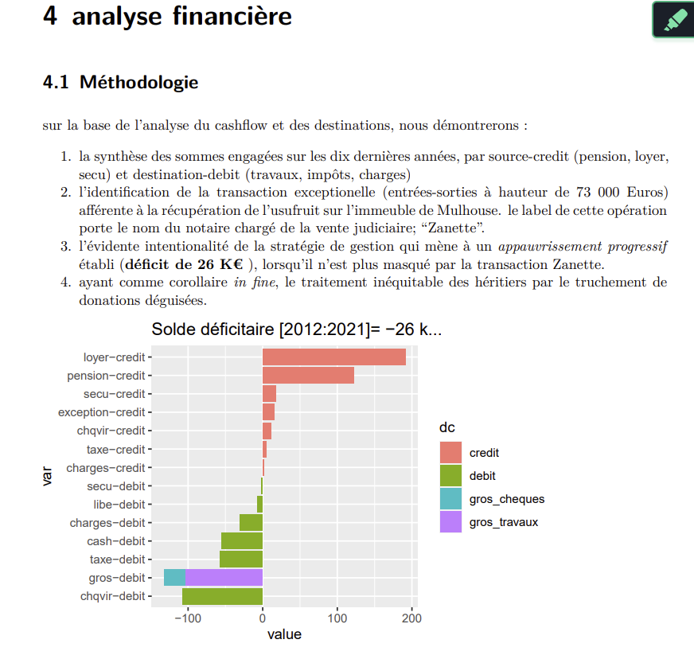
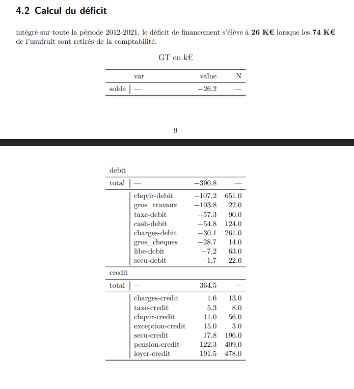

> **l'appauvrissement** en capital *in-fine* est manifeste au profit d'une conversion en valeurs immobilières, fiscalement neutre. Mais ces investissements trop tardifs apparaissent comme des donations déguisées, au demeurant structurellement inégalitaires.

{width="600"}

### Etablissement du déficit

