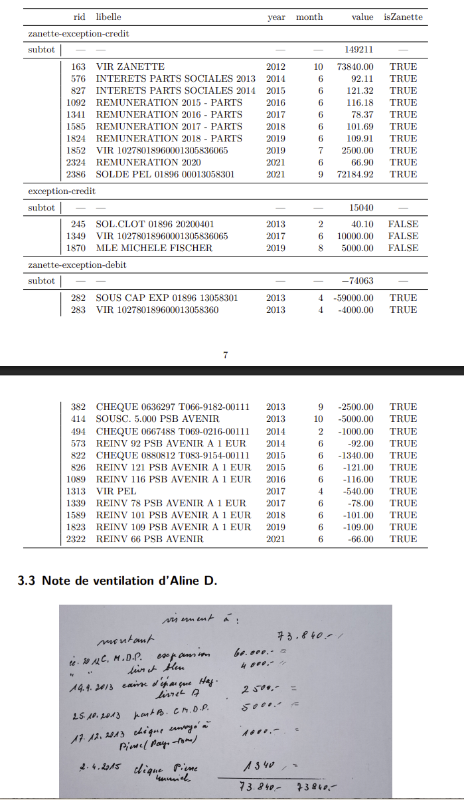

1.  Analyse des relevés bancaires et de chèques

-   le détail de l'allocation des gros chèques se trouve en Lotz Technique para.7)

2.  Isolation de la vente Zanette ( cf Lotz Technique para.3)

-   sur utilité du périmètre

-   isolation des transactions

-   note de ventilation

3.  calcul du train de vie et appauvrissement ( cf Lotz Technique para.4)

4.  transfert systémique vers immobilier ( cf Lotz Technique para.7)

-   par la prise en charge des gros travaux (de la responsabilité des nu_propriétaires) par l'usufruitière ( détail en Loz technique para.7)

5.  traitement inégalitaire des héritiers

### Périmètre Zanette

