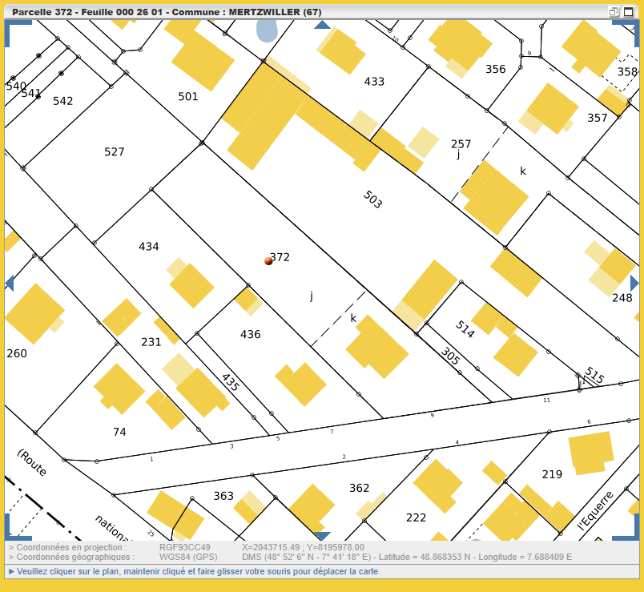

> aux fins du débat contradictoire, nous demandons

0.  l'explication des options pour l'acceptation de la succession et son impact, ex post.
1.  l'ensemble des factures étayant la construction complète de la maison d'Eschbach ainsi que le certificat d'achèvement des travaux
2.  le devis de l'hypothétique EHPAD accompagné du document déclaratif du degré de dépendance de la mère
3.  l'usage qui est fait du fond de la parcelle rue d'Eschbach par la société Pautler.

En effet, concernant la section 26 parcelle 372 /78 au 9 rue d'Eschbach de 17.99 ares au nom de Fischer Marguerite épouse Besnier, il apparait que le fond de parcelle (approx 300m2) est exploité selon toute vraisemblance par l'entreprise Pautler: à quel titre l'est-il: vente de terrain ou location de terrain (où va l'usufruit?) et où sont les actes correspondants ?

{width="326"}

{width="262"}

Suite à CGEE de Me Schott du 3Fev26: nous demandons les éclaircissements concernant les mouvements:

-   frais de succession 873 € à qui ?

-   frais de relevés bancaires 21\*8+7 = 175 € qui est le demandeur ? (alors que je les ai obtenus et payés via Office Lumière)

-   virements après le décès (quoi et qui) : Eau, Schittly, Diffiné, Wendling pour 6493 €
