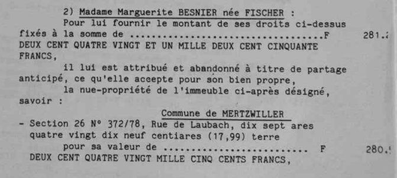
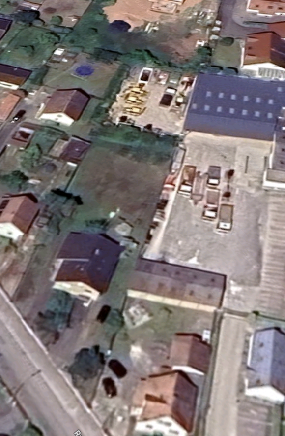

> Description, historique et sort du bien

NB. la donation-partage référence une **nature de terre** en origine et destination des biens. Ce qui est à confronter avec les dcouments fournis. ET qui au mieux souligne une irrégularité déclarative.

Concernant la section 26 parcelle 372 /78 au 9 rue d'Eschbach de 17.99 ares au nom de Fischer Marguerite épouse Besnier, il apparait que le fond de parcelle est exploité selon toute vraisemblance par l'entreprise Pautler: à quel titre l'est-il: vente de terrain ou location de terrain (où va l'usufruit?) et où sont les actes correspondants ?

Pautler Mickaël et Matthieu 03 88 90 31 37

{width="500"}

{width="500"}
