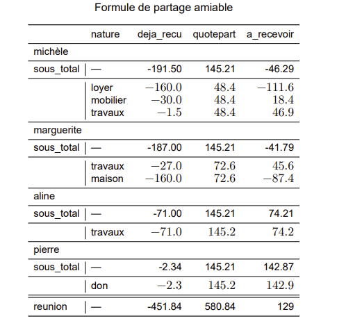

```{r, REUNION_data}
data <- tibble::tribble(
      ~beneficiaire, ~deja_recu, ~nature,
      "aline", -71, "travaux",
      "pierre", -2.34, "don",
      "michèle", -160, "loyer",
      "michèle", -30, "mobilier",
      "michèle", -1.5, "travaux",
      "marguerite", -27, "travaux",
      "marguerite", -160, "maison",
      "cash", 129, "banque"
) |>
  dplyr::summarise(deja_recu = sum(deja_recu), .by = tidyr::matches("beneficiaire|nature")) |>
  tibble::rowid_to_column("id") |>
  dplyr::add_count(beneficiaire) |>
  dplyr::mutate(reunion = sum(abs(deja_recu)),
                quotepart = dplyr::case_when(!beneficiaire == "cash"~ reunion/(4*n),
                                             TRUE~0),
                a_recevoir= quotepart+deja_recu)
```

```{r, REUNION_gt}
bene <- data$beneficiaire |> unique() 
bene <- bene[!bene %in% c('cash')]

data |>
  dplyr::select(-dplyr::matches("^id$|^n$|^reunion")) |>
  dplyr::filter(beneficiaire != "cash") |>
  gt::gt(groupname_col = "beneficiaire")  |>
   gt::summary_rows(
    groups = bene,
    columns = c("deja_recu","a_recevoir","quotepart"),
    fns = list(
      total = ~sum(., na.rm = TRUE)
    ),
    side= "top"
  ) |>
  gt::grand_summary_rows(
    columns = c("deja_recu","a_recevoir","quotepart"),
    fns = list(
      reunion = ~sum(., na.rm = TRUE)
    ),
    side= "top"
    ) |>
  gt::fmt_number(decimals=1) |>
  gt::tab_header("scénario 1 sans restitution d'usufruit")

```


