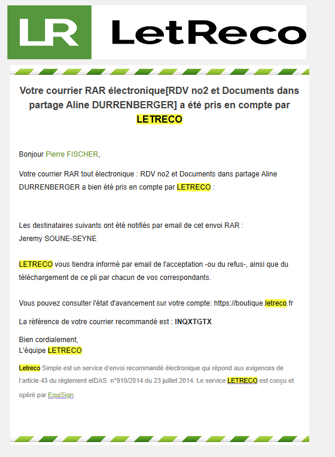

# Preface {.unnumbered}

**Contenu**

Ce document a été compilé suite à la rencontre de Me Schott du 12 Jan 2026.

Il apporte les fichiers des relevés bancaires, les fac-similés des grosses factures, et formule des questions qui attendent réponse.

Il récapitule les documents reçus, les documents demandés, les documents transmis.

Historique:

-   la version V0.2 de Schott2 du 6Feb26 **augmente** (cf 3-docs_demandés) les demandes d'éclaircissement sur les mouvements bancaires depuis le décès suite à la communication par Me Schott 
-   la première version a été transmise à Me Schott par Letreco du 2Fev26

{width="400"}
